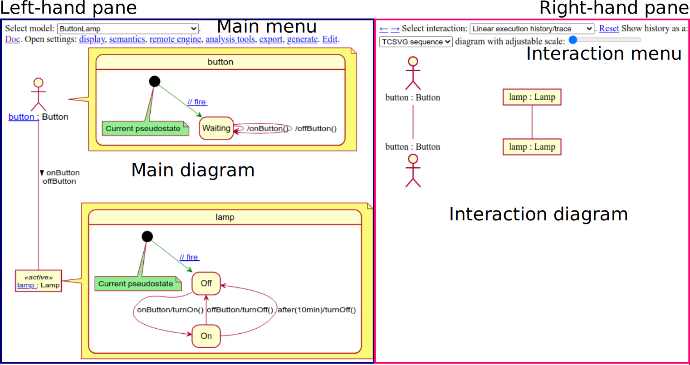

<style>
	.title {
		font-size: 3em;
		font-weight: 600;
		text-align: center;
	}
	.markdown-body {
		counter-reset: h1counter;
	}
	h1 {
		counter-reset: h2counter;
	}
	h1:before {
		content: counter(h1counter) ".\0000a0\0000a0";
		counter-increment: h1counter;
	}
	h2 {
		counter-reset: h3counter;
	}
	h2:before {
		content: counter(h1counter) "." counter(h2counter) ".\0000a0\0000a0";
		counter-increment: h2counter;
	}
	h3 {
		counter-reset: h4counter;
	}
	h3:before {
		content: counter(h1counter) "." counter(h2counter) "." counter(h3counter) ".\0000a0\0000a0";
		counter-increment: h3counter;
	}
	h4 {
		counter-reset: h5counter;
	}
	h4:before {
		content: counter(h1counter) "." counter(h2counter) "." counter(h3counter) "." counter(h4counter) ".\0000a0\0000a0";
		counter-increment: h4counter;
	}
	h5 {
		counter-reset: h6counter;
	}
	h5:before {
		content: counter(h1counter) "." counter(h2counter) "." counter(h3counter) "." counter(h4counter) "." counter(h5counter) ".\0000a0\0000a0";
		counter-increment: h5counter;
	}
	h6:before {
		content: counter(h1counter) "." counter(h2counter) "." counter(h3counter) "." counter(h4counter) "." counter(h5counter) "." counter(h6counter) ".\0000a0\0000a0";
		counter-increment: h6counter;
	}
</style>

<span class="title">AnimUML Tutorial</span>

# About this tutorial

The objective of this tutorial is to teach you how to use AnimUML.
Each section will present how to perform a task before directing you to try performing it yourself.
To this end, you will be asked to click on links that open the AnimUML user interface in a separate browser tab or window.
After performing the task, you can close that new tab or window, and go back to reading this tutorial.

# What to do in case of problems

Web browser caches are useful but they also frequently cause problems.
For AnimUML, such problems typically occur after an update: the server has new files, but the browser may have a mix of new and old files, which may break some dependencies.
The first action you should attempt in order to fix a problem with AnimUML is to reload it after having cleared your browser's cache.
This may be done globally for all websites, or just for a specific one.
For instance, with Chrome, the best way to proceed is to use "Empty Cache and Hard Reload" as described [on stackoverflow](https://stackoverflow.com/a/14969509).

# User interface overview

AnimUML's user interface consists of two panes:

* the left-hand pane contains:
	* the main menu, which offers the possibility to
		* select a different model than the current one with a [drop-down list](https://en.wikipedia.org/wiki/Drop-down_list)
		* open the documentation by clicking on the *Doc* link
		* open one of the sub-menus by clicking on: *display*, *semantics*, *remote engine*, *analysis tools*, *export*, or *generate*.
		* enter model edition mode by clicking on *Edit*.
	* the main diagram, which may display different views depending on the current display settings:
		* a class diagram
		* a communication diagram, with objects, actors, and connections between them
		* a state diagram
		* a hybrid diagram: a class or communication diagram with state diagrams as notes
* the right-hand pane is mostly dedicated to [interaction diagrams](https://en.wikipedia.org/wiki/Unified_Modeling_Language#Interaction_diagrams), and contains:
	* the interaction menu, which offers the possibility to
		* select a different interaction than the current one with a [drop-down list](https://en.wikipedia.org/wiki/Drop-down_list), among
			* *Linear execution history/trace*, which represents the current execution history
			* *Branching execution history/trace*, which represents all histories since last reset
			* a behavior specification as a sequence diagram, when available in the model
		* reset model execution by clicking on the *Reset* link
		* select a different interaction diagram with a drop-down list
		* adjust the scale of the current diagram with a slider, for compatible diagrams (e.g., timing diagram)
	* the interaction diagram, which may represent
		* an execution history, as a sequence or [timing diagram](https://en.wikipedia.org/wiki/Timing_diagram_(Unified_Modeling_Language)
		* a record of all histories
		* a behavior specification, as a sequence diagram

You may now open AnimUML by clicking <a href="/AnimUML.html#ButtonLamp" target="_blank">here</a>, and try to spot each of these elements.

# How to animate models

AnimUML model animation consists in performing various tasks on a model such as calling operations, and firing transitions.
These tasks result in changes to the model state, such as: a state machine current's state, an object's attribute values.
Moreover, each action is recorded in a model execution history that may be visualized on the interaction diagram (right-hand pane) in various forms, for instance as a sequence diagram.
Model animation may for example be used to create sequence diagrams.
It may also be used to evaluate whether a model is able works as intended, such as:
* does a given communication diagram capture enough information to play scenarios from [CRC cards](https://en.wikipedia.org/wiki/Class-responsibility-collaboration_card)?
* are state diagrams able to reproduce scenarios specified as sequence diagrams?

## Animating a communication diagram

Communication diagram animation is the simplest form of animation.
It only requires the model to contain objects and/or actors with operations, or to have connections bearing messages.
Remark: messages correspond to operation calls.
There are two main ways to send messages from a communication diagram:
 
* Message receival may be trigerred by clicking on a specific operation.
By default, the message will be considered *found*: without specific emitter/caller.
A message emitter/operation caller can be specified by clicking on an object name **before** clicking on an operation.
Remarks:
	* a second click on an operation that has just been called will not send a new message, but a third click will.
	* it is possible to add reflexive calls (i.e., an object calling one of its own operations) by first clicking on the object's name, to specify it as caller, before clicking on one of its operations.

You may now try to add new messages (e.g., `offButton` followed by `turnOff`) to the history sequence diagram of the model that you can open by clicking <a href='/AnimUML.html#{
	"name": "Test",
	"stateByName": {
		"init": {"kind": "initial"}
	},
	"historyCauses": ["operation:lamp.onButton:button", "operation:bulb.turnOn:lamp"],
	"settings": {
		"display": {
			"showEventPools": false,
			"hideStateMachines": true
		},
		"interface": {
			"load": "ButtonLampBulb",
			"disableExperimental": true
		},
		"semantics": {
			"checkEvents": false
		},
		"overrides": {
			"connectorByName.C1.possibleMessages": [],
			"connectorByName.C2.possibleMessages": []
		}
	}
}' target="_blank">here</a>.
Even though it may not make sense on this model, you can still try adding reflexive calls, for instance by clicking on `lamp`, and then on `onButton`.
A call from lamp to itself should appear in the sequence diagram.
* Connections between objects and actors may bear messages, whose directions are specified by arrows.
Clicking on such a message corresponds to an operation call with the arrow source as caller, and arrow target as callee.
There is no need to first click on the calling object as was previously the case.

You may now try to add new messages to the history sequence diagram of the model that you can open by clicking <a href='/AnimUML.html#{
	"name": "Test",
	"stateByName": {
		"init": {"kind": "initial"}
	},
	"historyCauses": ["operation:lamp.onButton:button", "operation:bulb.turnOn:lamp"],
	"settings": {
		"display": {
			"showEventPools": false,
			"hideStateMachines": true
		},
		"interface": {
			"load": "ButtonLampBulb",
			"disableExperimental": true
		},
		"semantics": {
			"checkEvents": false
		}
	}
}' target="_blank">here</a>.

## Animating a state diagram

If the main diagram (left-hand pane) is currently displaying one or several state diagrams, then it is possible to animate the model by clicking on transitions.
The current state (or pseudostate) of each state machine is colored in green or bears a green note (e.g., for initial pseudostates that are all black).
Each transition going out of the current state is activated, but it is only fireable if all of the following conditions are verified:
* it has no trigger, or its trigger corresponds to a message that has been received
* it has no guard, or its guard evaluates to true

Remark: several *semantics* settings impact the fireable status of transitions so that they may become fireable even when their triggers have not matched any received messages, or their guards do not evaluate to true.

If an activated transition is not fireable because its trigger does not match any received messages, then this trigger will be <font style="color:red;text-decoration:line-through">colored in red and stroked out</font>.
Similarly, if an activated transition is not fireable because its guard does not evaluate to true, then this guard will be <font style="color:red;text-decoration:line-through">colored in red and stroked out</font>.
Otherwise, if the transition is fireable, it will be displayed as a hyperlink.
Clicking on this hyperlink will fire the transition: receive the message matched by its trigger, and execute its effect.

Try animating the state machines of the ButtonLamp model that you can open by clicking <a href="/AnimUML.html#ButtonLamp" target="_blank">here</a>.
You may, for instance, try to obtain a sequence diagram with the following messages: `onButton`, `turnOn`, `offButton`, and `turnOff`.

# How to export diagrams

There are multiple ways to export diagrams from AnimUML.
It is for instance possible to use command line tools in order to automatically generate PlantUML or SVG files from AnimUML models.
These tools may be used in a Makefile that builds a LaTeX document in the same way PlantUML can be used.
However, in this tutorial we will only learn how to export diagrams using the user interface.
Until they are properly documented, please contact Frédéric Jouault if you want more information on these command line tools.

## Exporting diagrams from the user interface

The *export* sub-menu is part of the main menu at the top of the user interface left-hand pane.
It can be used to export the model itself in various formats, as we will see in [the next section](#how-to-export-and-modify-models).
But we will now use it to export specific diagrams.
There are two available links at the bottom of the *export* sub-menu: *main* and *interaction*.
The *main* link can be used to export the currently displayed main diagram (in the left-hand pane) as a PlantUML textual diagram.
The *interaction* link can be used to export the currently displayed interaction diagram (in the right-hand pane), such as a sequence diagram.
Interaction diagrams will be exported as PlantUML textual diagrams if they are displayed with PlantUML, and will be exported as SVG files otherwise.

You may now try to export some of the figures you used or created in the previous exercises.

## Using exported diagrams in LaTeX documents

PlantUML and SVG files may both be used as LaTeX document figures.
This may, for instance, be achieved using the following Makefile rules (using `.pu` as PlantUML file extension) to convert them to the PDF format:

```makefile
%.svg: %.pu
	plantuml -tsvg $<

%.pdf: %.svg
	rsvg-convert -f pdf $< > $@
	# if your distribution provides rsvg instead of rsvg-convert, use the following line instead:
	#rsvg -f pdf $< $@
```

On Debian-based Linux distributions (such as Ubuntu), the `plantuml` command is provided by the `plantuml` package, and `rsvg-convert` (or `rsvg`) is provided by the `librsvg2-bin` package.
You may for instance install these dependencies with the following command:

`sudo apt install librsvg2-bin plantuml`.

The resulting PDF files may then be included in a LaTeX document using `\includegraphics` (see for instance [Overleaf's documentation on inserting images in LaTeX documents](https://www.overleaf.com/learn/latex/Inserting_Images)).
Here is a very simple example:

```latex
\documentclass{article}

\usepackage{graphicx}

\begin{document}
\includegraphics{SequenceDiagram}
\end{document}
```

Such a `main.tex` file including a `SequenceDiagram` figure, which may be available as `SequenceDiagram.pu` (in PlantUML format) or `SequenceDiagram.svg` (in SVG), may be built using the following additional Makefile rules:

```makefile
all: main.pdf

%.pdf: %.tex
        latexmk -pdf $<

main.pdf: SequenceDiagram.pdf
```
Remarks:
* The fact that `main.tex` depends on `SequenceDiagram.pu` or `SequenceDiagram.svg` is expressed in terms of what is necessary to build `main.pdf`.
`make` will automatically apply the previous rules in order to build `SequenceDiagram.pdf` from `SequenceDiagram.pu` or `SequenceDiagram.svg` before building `main.pdf`.
* The rule to build a PDF file from a LaTeX file is specified generically for all LaTeX files, and the specific `SequenceDiagram.pdf` dependency required to build `main.pdf` is given in a separate rule.


# How to export and modify models

There are multiple ways to export AnimUML models, but we will only present the most versatile one here.
The *export* sub-menu is part of the main menu at the top of the user interface left-hand pane.
You can export the current model as an HTML file by clicking on *HTML file*.

This file can then be edited with any text editor in order to modify the model.
Loading this file in a web browser will load the modified model.
More information about editing models may be found in [the documentation](doc.html#defining-models-textually).

Try exporting the ButtonLamp model that you can open by clicking <a href="/AnimUML.html#ButtonLamp" target="_blank">here</a>.
You may then, for instance, remove the timer transition (with trigger `after(10min)`) before reloading the model.
